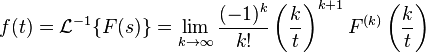

# NumericInverseLaplace
A math research project, using PSM methods to find inverse Laplace transfer numerically.

Simulator uses PSM methods to calculate numeric value and derivatives of function.

Use Post’s Inversion Formula:
<br>



We have a way to calculate the inverse laplace transform. However, this would involve very computational-intense process to obtain the convergence of Post's Forumula. This also involves high order derivative.

One method to approach high order derivatives is convert function into Taylor's series with Picard Iteration.
After we get a polynomial version of the function, calculation nth derivative would become so much easier.

I have tried several implementation of the Picard Iteration. These version are comp1, comp2, comp3 and comp4.
Simulator use those computation unit (comp[n]) to simulate the converge process. It provides a nice interface for testing.

Constructor takes a cell array of initial functions, an initial time, and an array of relationship between comp.
```
newSimulator = simulator(funct , initTime , relation);
```
One example:
```
s = simulator( {@(t)sin(t) @(t)cos(t) } , 0 , ...
   [rel( 1 , 1 , 0 , 2 ) ...
    rel( 2 , -1, 0 , 1 ) ] );
```
This represent the Picard Iteration for sin(t). If we let `(Comp #1) a = sin(t)  (Comp #2)b = cos(t)`, then `a' = b    b' = -a`
``rel(addTo, coefficient , order, comps )`` represent a term ``(Comp #addTo)' += coefficient * t^order * Multiplications of comps )``

```
simulator.converge(t, kk , answer)
```
This calculate the convergence curve at the specified t value, given vector field of k (See Post’s Formula).
Then it compares the result curve with a red dotted predicted answer.

Test_5 is for sin(t)

Test_6 is for cos(t)
